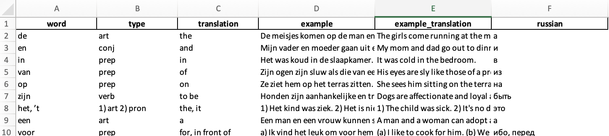

# Dutch words game project

#### MyPython
#### hobby

## Project Summary

This app is for learning dutch words with elements of gaming and self-competition.

## Project Description

If you need to learn words in any language (im my case, it was Dutch), you can copy
this Project files, place into data_files folder xlsx file with words in the
following columns:

Sheet name = 'words'
File name = 'init_words.xlsx'

Then you should use terminal for starting the app: app.py

## Project files:

### Main file:
app.py

### Necessary files:
cls.py
defs.py
exam.py
werkwoorden.py
word_plot.py

### Additional files:
sound_all_before.py
sound.py
graphs.py
trnsl.py
main.py
